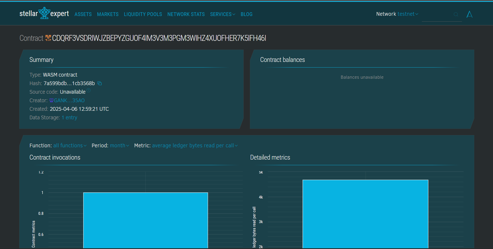

# NFT-Based Virtual Real Estate

## Project Title

NFT-Based-Virtual-Real-Estate

## Project Description

This project implements a smart contract for managing virtual real estate properties as non-fungible tokens (NFTs) on a blockchain. The smart contract is built using the Soroban SDK, which is a smart contract platform for the Stellar blockchain. The contract allows users to create, buy, sell, and manage virtual properties in a decentralized manner.

The smart contract enables users to mint new virtual properties as NFTs, list them for sale, buy properties from other users, and update property details. Each property has unique characteristics such as location, size, and price, and ownership is tracked on the blockchain.

## Contract Address Details :
CDQRF3VSDRIWJZBEPYZGUOF4IM3V3M3PGM3WIHZ4XUOFHER7K5IFH46I

## Project Vision

Our vision is to create a decentralized virtual real estate marketplace where users can own, trade, and develop digital land and properties. By leveraging blockchain technology and NFTs, we aim to establish a transparent, secure, and frictionless environment for virtual property transactions.

This platform will bridge the gap between digital ownership and real-world value, enabling new economic opportunities in the metaverse. Users will be able to purchase, sell, rent, and develop virtual land with true ownership rights secured by blockchain technology.

In the future, this project could expand to include integrations with virtual reality platforms, gaming environments, and other metaverse applications, creating a comprehensive ecosystem for virtual real estate.

## Key Features

1. **Property Creation (NFT Minting)**
   - Create unique virtual properties with customizable attributes
   - Each property is minted as an NFT with a unique identifier
   - Properties include details such as name, description, location, and size

2. **Ownership Management**
   - Secure property ownership tracked on the blockchain
   - View properties owned by any address
   - Transfer ownership through secure transactions

3. **Marketplace Functionality**
   - List properties for sale at user-defined prices
   - Remove properties from the marketplace
   - Purchase properties listed by other users
   - Transparent transaction history

4. **Property Management**
   - Update property details and metadata
   - Track property transaction history
   - View detailed property information

5. **Statistics and Analytics**
   - Track total properties in the ecosystem
   - Monitor properties currently for sale
   - View total transaction volume
   - Calculate total value locked in the platform

6. **Smart Contract Security**
   - Authorization checks for all ownership-sensitive operations
   - Immutable transaction records
   - Transparent and auditable codebase