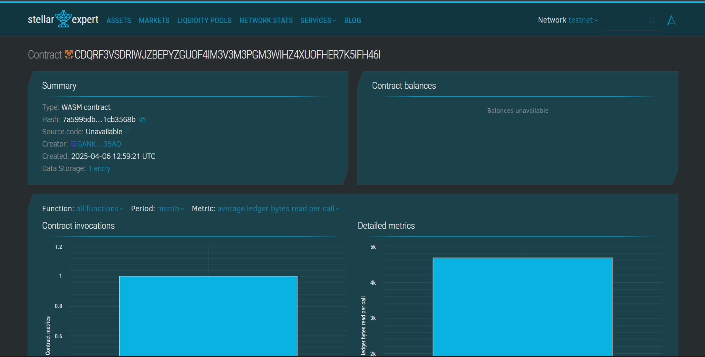

# 🪙 NFT-Based Virtual Real Estate

### A Decentralized Digital Property Marketplace Built on Stellar Soroban

---

## 📖 Overview

NFT-Based Virtual Real Estate is a decentralized application that demonstrates how digital land ownership can be managed on the **Stellar Soroban** blockchain using smart contracts written in **Rust**.

The project showcases the core concepts of blockchain-based property ownership, allowing virtual real estate assets to be represented as NFTs while ensuring transparency, security, and decentralized control.

---

## ✨ Key Features

- 🏡 NFT-based virtual property ownership
- ⛓️ Smart contract powered by Stellar Soroban
- 🔒 Secure decentralized asset management
- ⚡ Rust-based contract implementation
- 🌍 Web interface for interacting with the project
- 📱 Responsive frontend

---
